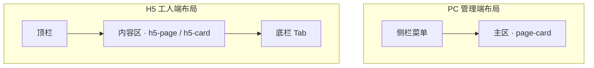

# 数字劳务 · 原型图说明

以下为系统主要界面的原型图，用于说明布局与信息结构。

---

## 1. PC 管理端 · 工作台

**文件**：`prototype-admin-dashboard.png`（已生成于 Cursor 项目 assets）

**内容概览**：
- **左侧边栏**：深色背景，顶部「数字劳务」+ 副标题「PC 管理端」；菜单：工作台、人员档案及实名中心（人员档案 / 认证管理 / 状态管理）、电子合同及签约中心、考勤与工时管理、智能结算中心、项目现场管理、综合数据看板、系统管理；底部「→ 工人端 H5」。
- **主内容区**：白色卡片「工作台」，简短说明 + 快捷入口按钮：人员档案、合同发起、考勤导入、结算确认、在岗看板、数据看板。

---

## 2. H5 工人端 · 我的合同

**文件**：`prototype-h5-contract.png`（已生成于 Cursor 项目 assets）

**内容概览**：
- **顶栏**：「← 管理端」、标题「数字劳务 · 工人端」、「退出」。
- **内容区**：「我的合同」下分两块——**待签合同**（卡片：标题、截止时间、「去签署」）；**已签合同**（卡片：标题、签署时间、「查看 / 下载 PDF」）。
- **底栏 Tab**：我的合同、我的考勤、我的薪资、个人中心。

---

## 3. 系统流程概览

**文件**：`prototype-system-flow.png`（已生成于 Cursor 项目 assets）

**内容概览**：
- **管理端**：登录、组织、用户、人员、合同、考勤、结算、看板等模块。
- **数据流**：考勤导入 → 工时报表 → 结算生成 → 确认。
- **工人端 H5**：工号姓名登录、待签合同、签署、考勤日历、待确认结算、个人中心、消息。
- **关联**：合同发起 → 通知 → 工人待签。

---

## 在项目中使用原型图

图片已生成在 Cursor 项目资源目录中，如需放入本仓库可：

1. 在项目下新建目录，例如 `docs/原型图/` 或 `功能点/原型图/`。
2. 将上述三个 PNG 文件从 Cursor 的 assets 目录复制到该目录。
3. 在需求或说明文档中引用，例如：``。

---

## 界面结构速查（Mermaid）

上述原型图与当前实现的页面结构一致，可直接对照 `web/src` 下各页面与布局组件使用。
