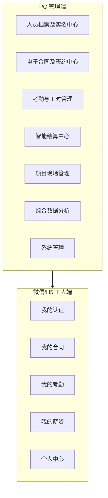

# Digital Labor · 报价表需求与当前实现对比

## 一、总览图（按终端）

---

## 二、功能点逐项对比表

| 序号 | 终端 | 一级模块 | 二级模块 | 报价表功能描述 | 实现状态 | 说明 |
|:---:|:---:|----------|----------|----------------|:--------:|------|
| 1 | PC | 人员档案及实名中心 | 人员档案 | 总览人员实名、合同、在岗状态，维护详细信息 | ✅ 已完成 | 列表筛选/分页、增删改查、合同/在岗状态字段 |
| 2 | PC | 人员档案及实名中心 | 认证管理 | 人脸采集、活体检测记录，身份证/手机登记，电子签名，人工审核 | 🟡 部分 | 身份证/手机登记状态列表、按「已补全」筛选；人脸/电子签仍预留 |
| 3 | PC | 人员档案及实名中心 | 状态管理 | 状态流（预注册→已实名→已签约→已进场→已离场）及黑名单 | ✅ 已完成 | 状态统计、批量变更，与在岗 on_site 联动 |
| 4 | PC | 电子合同及签约中心 | 合同模板 | 模板上传，可视化显示，版本控制 | 🟡 部分 | 名称新增、列表、文件上传、版本展示；无可视化模板编辑 |
| 5 | PC | 电子合同及签约中心 | 合同发起 | 按项目/班组/个人批量发起，截止时间与逾期提醒 | ✅ 已完成 | 多选人员、标题、截止日发起；签约状态列表展示「即将逾期/已逾期」 |
| 6 | PC | 电子合同及签约中心 | 签约状态 | 实时签署进度，已签署 PDF 及存证 | 🟡 部分 | 有进度列表与状态，无 PDF/存证（可后接 e 签宝） |
| 7 | PC | 电子合同及签约中心 | 合同归档 | 多维度检索，下载、作废 | ✅ 已完成 | 按项目/人员/标题/签署时间检索，支持作废（下载可后接 PDF） |
| 8 | PC | 考勤与工时管理 | 考勤数据接入 | Excel 批量导入，自动清洗与排重 | ✅ 已完成 | 上传解析、按表头匹配、排重写入 |
| 9 | PC | 考勤与工时管理 | 工时报表 | 个人/班组/项目维度，自定义周期统计与导出 | ✅ 已完成 | 按人员/组织/日期筛选、分页、CSV 导出 |
| 10 | PC | 智能结算中心 | 结算单生成与确认 | 基于工时生成待确认单，审核调整，应发/已发，批量推送 | ✅ 已完成 | 按周期生成、列表确认/驳回、应发已发；支持「批量推送通知」到工人端站内 |
| 11 | PC | 智能结算中心 | 薪资报表与成本分析 | 人力成本月报、个人薪资历史、薪酬构成分析 | ✅ 已完成 | 按人员/组织/月份查询结算列表与历史 |
| 12 | PC | 项目现场管理 | 离场登记 | 更改在场状态或结算确认后离场 | ✅ 已完成 | 选择在岗人员登记离场，更新 on_site |
| 13 | PC | 项目现场管理 | 在岗人员实时看板 | 大屏展示各项目/班组在岗人数与详情 | ✅ 已完成 | 按组织汇总在岗人数与合计，列表展示 |
| 14 | PC | 综合数据分析 | 综合数据看板 | KPI（总人数、实名率、签约率、在岗率）、趋势图 | ✅ 已完成 | KPI 卡片 + 近 7/30/90 天趋势图（新增人员、签约数、考勤人次与工时） |
| 15 | PC | 系统管理 | 用户管理 | 账号创建、批量导入、启用/禁用/重置密码、离职注销 | ✅ 已完成 | 增删改、批量导入、启用禁用、改密、一键注销（禁用并标已注销） |
| 16 | PC | 系统管理 | 组织管理 | 公司/项目部/标段/班组层级，数据隔离 | ✅ 已完成 | 树形 CRUD，类型与层级 |
| 17 | PC | 系统管理 | 权限分配 | 预定义与自定义角色，菜单/按钮/数据范围 | 🟡 部分 | 预定义 admin/user 角色，按角色返回可见菜单（my-menu），user 隐藏用户管理/权限分配/操作日志 |
| 18 | PC | 系统管理 | 操作日志 | 操作人、时间、模块、内容、结果 | ✅ 已完成 | 中间件统一记录，分页查询 |
| 19 | H5 | 我的认证 | 扫码激活/工号查询 | 扫码或工号+姓名进入激活 | 🟡 部分 | 登录页支持 ?code= 扫码落地；激活页工号+姓名跳登录；人脸未接 |
| 20 | H5 | 我的认证 | 人脸实名认证 | 活体检测、人脸采集上传 | ⚪ 占位 | 页面占位，未接人脸接口 |
| 21 | H5 | 我的认证 | 信息补全与绑定 | 身份证、手机号、签名 | ✅ 已完成 | 独立页表单（身份证、手机号），提交走 PUT /worker/me；签名可后续接电子签 |
| 22 | H5 | 我的合同 | 待签合同列表 | 合同名称、项目、发起方、截止时间 | ✅ 已完成 | 列表展示，跳签署页 |
| 23 | H5 | 我的合同 | 合同签署 | 二次人脸验证、全文阅读（强制时长）、确认提交 | 🟡 部分 | 确认即签署（模拟），无人脸/强制阅读时长 |
| 24 | H5 | 我的合同 | 已签合同查阅 | 查看、下载已签 PDF | 🟡 部分 | 详情页 + 下载 PDF 入口（有文件则下载，无则提示对接 e 签宝） |
| 25 | H5 | 我的考勤 | 每日考勤记录 | 日历视图、上下班时间、工时 | ✅ 已完成 | 按月日历展示、有考勤日期显示工时、点击查当日详情 |
| 26 | H5 | 我的薪资 | 待确认结算单 | 周期与总金额，人脸验证后确认或驳回 | 🟡 部分 | 列表、确认/驳回已做，无人脸验证 |
| 27 | H5 | 我的薪资 | 薪资历史记录 | 按月历史发薪、电子工资条下载 | ✅ 已完成 | 结算历史列表；支持下载电子工资条（HTML） |
| 28 | H5 | 个人中心 | 个人信息维护 | 数字档案、改密码/手机号（需验证） | ✅ 已完成 | 档案展示、手机号/身份证维护；改密码由管理端操作 |
| 29 | H5 | 个人中心 | 消息通知中心 | 合同待签、结算待确认、工资发放等通知 | ✅ 已完成 | 站内列表、合同/结算/发放自动写入、标已读 |

**图例**：✅ 已完成　🟡 部分完成　⚪ 占位/未做

---

## 三、按实现状态汇总

| 状态 | 数量 | 占比（约） |
|------|:----:|:----------:|
| ✅ 已完成 | 22 | 76% |
| 🟡 部分完成 | 6 | 21% |
| ⚪ 占位/未做 | 1 | 3% |

---

## 四、未覆盖或简化的要点（与报价表差异）

- **人脸/活体**：认证管理、H5 人脸实名、结算单确认前人脸验证等均未对接第三方，仅占位或跳过。
- **电子签与 PDF**：合同为系统内状态签署，无 e 签宝等对接；已签合同若存有 pdf_path 可下载，无则占位提示。
- **消息通知**：已实现站内通知表、列表接口、H5 消息中心；合同发起/结算生成/工资确认时自动写入通知。
- **权限**：无菜单/按钮/数据范围细粒度配置，仅登录与工人/管理端区分。
- **批量与推送**：用户已支持 Excel 批量导入；结算单无“批量推送”到工人端（工人端为主动拉取列表）。
- **展示形式**：H5 考勤已支持按月日历视图；数据看板已含趋势图；合同归档已支持多维度检索与作废。

---

## 五、测试用例与执行结果

### 5.1 后端 API 自动化测试

执行方式：在 `server` 目录下执行 `npm test`（使用 Node 内置 test + supertest，不启动端口）。

| 用例编号 | 用例描述 | 预期 | 执行结果 |
|:--------:|----------|------|:--------:|
| 1 | GET /api/health | 200, body.ok=true | 通过 |
| 2 | GET /api/sys/org 无 token | 401 | 通过 |
| 3 | POST /api/auth/login 正确账号密码 | 200, 返回 token 与 user | 通过 |
| 4 | POST /api/auth/login 错误密码 | 401 | 通过 |
| 5 | 带 token GET /api/sys/org | 200, tree 数组 | 通过 |
| 6 | 带 token GET /api/person/archive | 200, list+total | 通过 |
| 7 | 带 token GET /api/data/board | 200, 含 total/realNameRate 等 | 通过 |
| 8 | POST /api/auth/worker-login 无匹配人员 | 401 | 通过 |
| 9 | POST /api/sys/org 新增组织 | 200, 返回 id | 通过 |
| 10 | 带 token GET /api/site/board | 200, projects+total | 通过 |

**当前结果**：12/12 通过（执行时间约 1.5s）。

### 5.2 前端测试用例（建议手动或后续接入 Vitest）

以下为建议检查项，可按清单在浏览器中逐项验证。

**管理端（/admin，先登录 admin / admin123）**

| 编号 | 页面/场景 | 操作步骤 | 预期结果 |
|:----:|-----------|----------|----------|
| F1 | 登录 | 错误密码提交 | 提示错误，不跳转 |
| F2 | 登录 | 正确账号密码 | 跳转工作台，侧栏可见 |
| F3 | 组织管理 | 新增节点 → 编辑 → 删除子节点 | 树更新正确 |
| F4 | 用户管理 | 新增用户 → 编辑禁用 | 列表更新 |
| F5 | 人员档案 | 筛选状态/组织、新增、编辑、删除 | 列表与分页正确 |
| F6 | 状态管理 | 批量变更状态（输入 ID+选择状态） | 各状态人数更新 |
| F7 | 考勤导入 | 上传含「姓名」「日期」的 Excel | 提示导入条数 |
| F8 | 工时报表 | 选日期范围、导出 CSV | 有数据或空表、文件下载 |
| F9 | 结算确认 | 选周期生成 → 列表确认/驳回 | 状态变更 |
| F10 | 离场登记 | 选在岗人员提交 | 看板人数减少 |
| F11 | 数据看板 | 打开页面 | 四类 KPI 有数字 |
| F12 | 合同发起 | 选多人、填标题、发起 | 签约状态列表可见 |
| F13 | 操作日志 | 打开列表 | 有分页与记录 |
| F14 | 用户管理 | 对某用户点「注销」 | 状态变为已注销，该用户无法登录 |
| F15 | 合同模板 | 上传文件 + 填名称 | 列表中显示版本与「已上传」 |

**工人端（/h5，先工号+姓名登录已有人员）**

| 编号 | 页面/场景 | 操作步骤 | 预期结果 |
|:----:|-----------|----------|----------|
| H1 | 工人登录 | 不存在的工号姓名 | 提示未找到 |
| H2 | 我的合同 | 有待签时打开 | 列表可点「去签署」 |
| H3 | 合同签署 | 确认签署 | 返回列表，该条消失 |
| H4 | 我的考勤 | 打开、切换月份、点击有考勤的日期 | 日历展示当月，点击日期显示当日工时与上下班 |
| H5 | 待确认结算单 | 确认/驳回 | 列表更新 |
| H6 | 薪资历史 | 打开 | 有结算记录则显示 |
| H7 | 消息通知中心 | 打开 | 有合同/结算/发放时显示列表，可标已读 |
| H8 | 个人中心 | 查看档案、修改手机号后保存 | 展示工号/姓名/组织，保存成功提示 |
| H9 | 已签合同查阅 | 进入已签合同详情、点「下载 PDF」 | 有 PDF 则下载，无则提示对接 e 签宝 |

---

## 六、后续部分设计

### 6.1 优先级建议（已实现项已从下表移除）

| 优先级 | 内容 | 说明 |
|:------:|------|------|
| P0 | 人脸/活体对接（可选厂商） | 认证管理、H5 实名、结算确认前校验；需预留接口与配置项 |
| P0 | 电子签与 PDF（如 e 签宝） | 合同生成 PDF、签署存证、下载；当前为状态流可先沿用 |
| P1 | 权限分配 | 角色表、菜单/按钮权限配置、前端按权限显隐；可沿用现有 user.role 做简单扩展 |
| P2 | ~~H5 考勤日历视图~~ | ✅ 已实现：按月日历、点击日期查当日工时 |
| P3 | 合同模板可视化编辑 | 当前为上传+版本展示，无可视化编辑 |

### 6.2 接口预留建议

- **人脸**：`POST /api/person/face-verify`（上传图片或 base64，返回是否通过），前端在需要处调用。
- **通知**：`GET /api/notify/list`、`PUT /api/notify/:id/read`，表 `notification (user_id/worker_id, type, title, body, read, created_at)`。
- **权限**：现有 `user.role` 可扩展为角色表 + 角色菜单表，接口 `GET /api/sys/my-menu` 返回当前用户可见菜单，前端据此渲染侧栏。

### 6.3 测试扩展建议

- 后端：在 `server/test/` 增加合同发起、考勤导入（mock 文件）、结算生成等用例；CI 中执行 `npm test`。
- 前端：引入 Vitest + React Testing Library，对 `api.js`、`utils.js` 及关键页面（如登录、人员列表）做单测或简单集成测；E2E 可用 Playwright 覆盖主流程。
