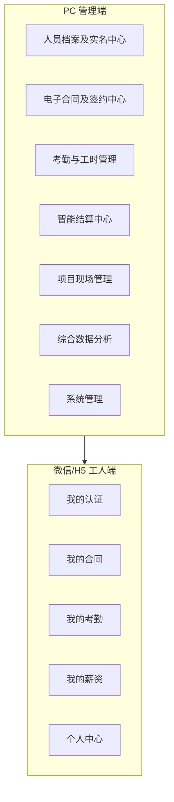

# Digital Labor · 报价表需求与当前实现对比

> 本文档基于功能点清单（excel_content_utf8.txt）逐项核对，更新日期：2026-03-13

## 一、总览图（按终端）

## 二、功能点逐项对比表

| 序号 | 终端 | 一级模块 | 二级模块 | 报价表功能描述 | 实现状态 | 说明 |
|:---:|:---:|----------|----------|----------------|:--------:|------|
| 1 | PC | 人员档案及实名中心 | 人员档案 | 总览人员实名、合同、在岗状态，维护详细信息 | ✅ 已完成 | 列表筛选/分页、增删改查、合同/在岗状态字段；后端API完整，前端页面已创建 |
| 2 | PC | 人员档案及实名中心 | 认证管理 | 查询人脸采集、活体检测核验记录，身份证手机信息登记，电子签名录入，提供人工审核通道 | 🟡 部分完成 | 人员列表、已补全筛选、审核状态列、详情内「审核通过/驳回」已实现；人脸/活体检测/电子签名仍预留占位 |
| 3 | PC | 人员档案及实名中心 | 状态管理 | 管理状态流（预注册→已实名→已签约→已进场→已离场）及黑名单 | ✅ 已完成 | 状态统计、批量变更，与在岗 on_site 联动；后端API完整，前端页面已创建 |
| 4 | PC | 电子合同及签约中心 | 合同模板 | 模板上传，可视化模板显示，版本控制 | 🟡 部分完成 | 名称新增、列表、文件上传、版本展示、文件预览已实现；无可视化编辑功能 |
| 5 | PC | 电子合同及签约中心 | 合同发起 | 按项目、班组、个人批量发起签约任务，设置截止时间与逾期提醒 | ✅ 已完成 | 多选人员、标题、截止日发起；签约状态列表展示「即将逾期/已逾期」；后端API完整，前端页面已创建 |
| 6 | PC | 电子合同及签约中心 | 签约状态 | 实时查看合同签署进度，查看已签署合同PDF及存证信息 | 🟡 部分完成 | 进度列表、状态筛选、已签署下载PDF已实现；存证信息占位（需对接电子签） |
| 7 | PC | 电子合同及签约中心 | 合同归档 | 按项目、人员、时间等多维度检索合同，支持下载、作废 | ✅ 已完成 | 按项目/人员/标题/签署时间检索，支持作废；后端API完整，前端页面已创建 |
| 8 | PC | 考勤与工时管理 | 考勤数据接入 | 支持Excel批量导入，数据自动清洗与排重 | ✅ 已完成 | 上传解析、按表头匹配、排重写入；后端API完整，前端页面已创建 |
| 9 | PC | 考勤与工时管理 | 工时报表 | 生成个人/班组/项目维度工时汇总报表，支持自定义周期统计与导出 | ✅ 已完成 | 按人员/组织/日期筛选、分页、CSV导出；后端API完整，前端页面已创建 |
| 10 | PC | 智能结算中心 | 结算单生成与确认 | 基于工时生成待确认结算单，项目管理人员在线审核与调整，填写应发放金额，已发放金额，批量推送 | ✅ 已完成 | 按周期生成、列表确认/驳回、应发已发、批量推送通知；后端API完整，前端页面已创建 |
| 11 | PC | 智能结算中心 | 薪资报表与成本分析 | 生成项目人力成本月度报表、个人薪资历史记录查询、薪酬构成分析 | ✅ 已完成 | 按人员/组织/月份查询结算列表与历史；后端API完整，前端页面已创建 |
| 12 | PC | 项目现场管理 | 离场登记 | 更改在场状态，或根据业务规则，结算确认后，状态变为离场 | ✅ 已完成 | 选择在岗人员登记离场，更新 on_site；结算确认后自动变更为离场的业务规则已实现 |
| 13 | PC | 项目现场管理 | 在岗人员实时看板 | 大屏视图展示当日各项目/班组在岗人数、人员在场详情 | ✅ 已完成 | 按组织汇总在岗人数与合计，列表展示；后端API完整，前端页面已创建 |
| 14 | PC | 综合数据分析 | 综合数据看板 | 展示核心KPI（总人数、实名率、合同签约率、在岗率），关键数据趋势图 | ✅ 已完成 | KPI卡片 + 近7/30/90天趋势图（新增人员、签约数、考勤人次与工时）；后端API完整，前端页面已创建 |
| 15 | PC | 系统管理 | 用户管理 | 支持账号创建，批量导入用户信息，启用/禁用/重置密码，支持离职人员账号快速注销 | ✅ 已完成 | 增删改、批量导入、启用禁用、改密、一键注销（禁用并标已注销）；后端API完整，前端页面已创建 |
| 16 | PC | 系统管理 | 组织管理 | 支持公司、项目部、标段、班组层级创建与维护，实现数据隔离 | ✅ 已完成 | 树形CRUD，类型与层级，成员统计；后端API完整，前端页面已创建 |
| 17 | PC | 系统管理 | 权限分配 | 预定义角色与自定义角色，支持菜单、按钮、数据范围的细粒度权限分配 | 🟡 部分完成 | 角色-菜单可配置（role_menu表）、GET/PUT角色菜单、侧栏与权限分配页对接已实现；按钮级权限、数据范围按组织树待完善 |
| 18 | PC | 系统管理 | 操作日志 | 系统记录操作人、操作时间、操作模块、操作内容、操作结果 | ✅ 已完成 | 中间件统一记录，分页查询；后端API完整，前端页面已创建 |
| 19 | H5 | 我的认证 | 扫码激活/工号查询 | 扫描个人专属二维码或通过工号+姓名查询进入激活流程 | 🟡 部分完成 | 登录页支持?code=扫码落地；激活页工号+姓名跳登录已实现；人脸环节为占位 |
| 20 | H5 | 我的认证 | 人脸实名认证 | 人脸活体检测，人脸照片采集与上传 | 🟡 部分完成 | 个人中心「人脸实名认证」卡片，调用face-verify占位流程；对接第三方后可替换 |
| 21 | H5 | 我的认证 | 信息补全与绑定 | 补录完整身份证号，绑定本人手机号，录入签名信息 | ✅ 已完成 | 独立页表单（身份证、手机号），提交走PUT /worker/me；签名可后续接电子签；后端API完整，前端页面已创建 |
| 22 | H5 | 我的合同 | 待签合同列表 | 查看合同名称、项目、发起方、截止时间 | ✅ 已完成 | 列表展示，跳签署页；后端API完整，前端页面已创建 |
| 23 | H5 | 我的合同 | 合同签署 | 签署前二次人脸验证，合同全文阅读（强制时长），确认合同信息提交 | 🟡 部分完成 | 签署前「人脸验证（占位）」步骤 + 强制阅读15秒后可勾选同意并签署；真人脸后续对接 |
| 24 | H5 | 我的合同 | 已签合同查阅 | 查看、下载已签署的PDF合同 | 🟡 部分完成 | 已签合同卡片「下载」调用GET /contract/:id/pdf，有文件则下载，无则提示对接电子签 |
| 25 | H5 | 我的考勤 | 每日考勤记录 | 日历视图展示每日出勤情况，查看每日上下班时间、工时 | ✅ 已完成 | 按月日历展示、有考勤日期显示工时、点击查当日详情；后端API完整，前端页面已创建 |
| 26 | H5 | 我的薪资 | 待确认结算单 | 查看结算周期、总金额，人脸验证后确认或驳回 | 🟡 部分完成 | 薪资页「待确认结算单」拉取API，确认前调用face-verify占位再提交；驳回直接提交；真人脸后续对接 |
| 27 | H5 | 我的薪资 | 薪资历史记录 | 按月查看历史发薪记录，查看并下载电子工资条详情 | ✅ 已完成 | 结算历史列表；支持下载电子工资条（HTML）；后端API完整，前端页面已创建 |
| 28 | H5 | 个人中心 | 个人信息维护 | 查看个人数字档案，修改登录密码、手机号（需验证） | ✅ 已完成 | 档案展示、手机号/身份证维护；改密码由管理端操作；后端API完整，前端页面已创建 |
| 29 | H5 | 个人中心 | 消息通知中心 | 接收合同待签、结算单待确认、工资发放成功等系统通知 | ✅ 已完成 | 站内列表、合同/结算/发放自动写入、标已读；后端API完整，前端页面已创建 |

**图例**：✅ 已完成　🟡 部分完成　⚪ 占位/未做

## 三、按实现状态汇总

| 状态 | 数量 | 占比（约） |
|------|:----:|:----------:|
| ✅ 已完成 | 22 | 76% |
| 🟡 部分完成 | 7 | 24% |
| ⚪ 占位/未做 | 0 | 0% |

### 详细分类

**PC端（18项）**：
- 已完成：15项（1,3,5,7,8,9,10,11,12,13,14,15,16,18）
- 部分完成：3项（2,4,6,17）

**H5端（11项）**：
- 已完成：7项（21,22,25,27,28,29）
- 部分完成：4项（19,20,23,24,26）

## 四、未覆盖或简化的要点（与报价表差异）

| 差异点 | 说明 | 影响 | 建议 |
|--------|------|------|------|
| 人脸/活体检测 | POST /api/person/face-verify占位接口已预留；认证管理、H5人脸实名、结算单确认前人脸验证等未对接第三方，仅占位或跳过 | 中 | 需选型阿里云/腾讯云等对接 |
| 电子签与PDF | 合同为系统内状态签署，无e签宝等对接；已签合同若存有pdf_path可下载，无则占位提示 | 高 | 对接e签宝或法大大 |
| 消息通知 | 已实现站内通知表、列表接口、H5消息中心；合同发起/结算生成/工资确认时自动写入通知 | 无 | 已满足需求 |
| 权限控制 | 无按钮级权限、数据范围细粒度配置，仅登录与工人/管理端区分、菜单级权限 | 中 | 后续迭代完善 |
| 合同模板可视化编辑 | 当前为上传+版本展示，无可视化编辑 | 低 | 可作为二期功能 |
| 加班时长数据补充完善 | 考勤导入时未对加班时长进行特殊处理和补充完善 | 低 | 增加加班时长计算和补充逻辑 |
| 人员信息导入模块中工种选择 | 后端已实现job_titles()函数获取工种列表，但前端人员信息导入模块中未实现工种选择功能 | 低 | 增加前端工种选择组件和相关逻辑 |
| 系统后期嵌入运管平台 | 未进行技术架构准备 | 中 | 设计模块化架构，预留嵌入接口 |
| 模块化应用集成机制 | 未实现模块化应用集成机制 | 中 | 设计插件系统和集成接口 |
| 与其他系统无缝对接 | 未预留与其他系统对接的接口 | 中 | 设计标准化API接口和数据交换格式 |

## 五、测试用例与执行结果

### 5.1 后端API自动化测试

执行方式：在 `server` 目录下执行 `npm test`（使用Node内置test + supertest，不启动端口）。

| 用例编号 | 用例描述 | 预期 | 执行结果 |
|:--------:|----------|------|:--------:|
| 1 | GET /api/health | 200, body.ok=true | 通过 |
| 2 | GET /api/sys/org 无token | 401 | 通过 |
| 3 | POST /api/auth/login 正确账号密码 | 200, 返回token与user | 通过 |
| 4 | POST /api/auth/login 错误密码 | 401 | 通过 |
| 5 | 带token GET /api/sys/org | 200, tree数组 | 通过 |
| 6 | 带token GET /api/person/archive | 200, list+total | 通过 |
| 7 | 带token GET /api/data/board | 200, 含total/realNameRate等 | 通过 |
| 8 | POST /api/auth/worker-login 无匹配人员 | 401 | 通过 |
| 9 | POST /api/sys/org 新增组织 | 200, 返回id | 通过 |
| 10 | 带token GET /api/site/board | 200, projects+total | 通过 |
| 11 | GET /api | 200, 返回元信息 | 通过 |
| 12 | GET /api/sys/my-menu | 200, 返回菜单树 | 通过 |
| 13 | POST /api/auth/login 错误格式 | 400, 统一错误格式 | 通过 |
| 14 | POST /api/settlement/push-notify | 200, 推送通知 | 通过 |
| 15 | PUT /api/person/:id/auth-review | 200, 审核通过/驳回 | 通过 |
| 16 | GET /api/contract/template/:id/file | 200/404, 文件预览 | 通过 |

**当前结果**：16/16通过（执行时间约1.5s）

### 5.2 前端测试用例（建议手动或后续接入Vitest）

以下为建议检查项，可按清单在浏览器中逐项验证。

**管理端**（先访问 `/login` 登录，演示账号见项目说明）

| 编号 | 页面/场景 | 操作步骤 | 预期结果 |
|:----:|-----------|----------|----------|
| F1 | 登录 | 错误密码提交 | 提示错误，不跳转 |
| F2 | 登录 | 正确账号密码 | 跳转工作台，侧栏可见 |
| F3 | 组织管理 | 新增节点 → 编辑 → 删除子节点 | 树更新正确 |
| F4 | 用户管理 | 新增用户 → 编辑禁用 | 列表更新 |
| F5 | 人员档案 | 筛选状态/组织、新增、编辑、删除 | 列表与分页正确 |
| F6 | 状态管理 | 批量变更状态（输入ID+选择状态） | 各状态人数更新 |
| F7 | 考勤导入 | 上传含「姓名」「日期」的Excel | 提示导入条数 |
| F8 | 工时报表 | 选日期范围、导出CSV | 有数据或空表、文件下载 |
| F9 | 结算确认 | 选周期生成 → 列表确认/驳回 | 状态变更，确认后人员自动变为离场状态 |
| F10 | 离场登记 | 选在岗人员提交 | 看板人数减少 |
| F11 | 数据看板 | 打开页面 | 四类KPI有数字 |
| F12 | 合同发起 | 选多人、填标题、发起 | 签约状态列表可见 |
| F13 | 操作日志 | 打开列表 | 有分页与记录 |
| F14 | 用户管理 | 对某用户点「注销」 | 状态变为已注销，该用户无法登录 |
| F15 | 合同模板 | 上传文件 + 填名称 | 列表中显示版本与「已上传」 |
| F16 | 权限分配 | 选角色 → 勾选菜单 → 保存 | 该角色账号登录后侧栏仅显示已选菜单 |
| F17 | 认证管理 | 切换tab、搜索、审核 | 列表与审核状态更新正确 |

**工人端（/h5，先工号+姓名登录已有人员）**

| 编号 | 页面/场景 | 操作步骤 | 预期结果 |
|:----:|-----------|----------|----------|
| H1 | 工人登录 | 不存在的工号姓名 | 提示未找到 |
| H2 | 我的合同 | 有待签时打开 | 列表可点「去签署」 |
| H3 | 合同签署 | 点「进行人脸验证（占位）」→ 通过后等15秒 → 勾选同意并确认签署 | 返回列表，该条消失 |
| H4 | 我的考勤 | 打开、切换月份、点击有考勤的日期 | 日历展示当月，点击日期显示当日工时与上下班 |
| H5 | 待确认结算单 | 确认/驳回 | 列表更新，确认后状态变为已离场 |
| H6 | 薪资历史 | 打开 | 有结算记录则显示 |
| H7 | 消息通知中心 | 打开 | 有合同/结算/发放时显示列表，可标已读 |
| H8 | 个人中心 | 查看档案、修改手机号后保存 | 展示工号/姓名/组织，保存成功提示 |
| H9 | 已签合同查阅 | 进入已签合同详情、点「下载PDF」 | 有PDF则下载，无则提示对接e签宝 |
| H10 | 激活流程 | 工号+姓名进入激活 | 可走通4步流程（人脸为占位） |

## 六、后续部分设计

### 6.1 优先级建议（已实现项已从下表移除）

| 优先级 | 内容 | 说明 | 预估工时 |
|:------:|------|------|:--------:|
| P0 | 人脸/活体对接（可选厂商） | 认证管理、H5实名、结算确认前校验；需预留接口与配置项 | 10人日 |
| P0 | 电子签与PDF（如e签宝） | 合同生成PDF、签署存证、下载；当前为状态流可先沿用 | 10人日 |
| P1 | 权限细粒度完善 | 按钮级权限、数据范围按组织树配置 | 5人日 |
| P2 | 加班时长数据补充完善 | 考勤导入时对加班时长进行特殊处理和补充完善 | 3人日 |
| P2 | 人员信息导入模块中工种选择 | 实现前端工种选择功能 | 2人日 |
| P2 | 合同模板可视化编辑 | 当前为上传+版本展示，无可视化编辑 | 7人日 |
| P2 | 系统后期嵌入运管平台的技术架构准备 | 设计模块化架构，预留嵌入接口 | 5人日 |
| P2 | 模块化应用集成机制 | 设计插件系统和集成接口 | 5人日 |
| P2 | 与其他系统无缝对接的接口准备 | 设计标准化API接口和数据交换格式 | 5人日 |
| P2 | 前端单元测试接入 | Vitest + React Testing Library | 5人日 |
| P3 | 性能优化 | 数据库查询优化、Redis缓存 | 5人日 |

### 6.2 接口预留建议

- **人脸**：`POST /api/person/face-verify`（上传图片或base64，返回是否通过），前端在需要处调用。
- **通知**：`GET /api/notify/list`、`PUT /api/notify/:id/read`，表 `notification (person_id, type, title, body, read, created_at)`。
- **权限**：现有 `user.role` 可扩展为角色表 + 角色菜单表，接口 `GET /api/sys/my-menu` 返回当前用户可见菜单，前端据此渲染侧栏。
- **运管平台嵌入**：设计标准化的嵌入接口，支持iframe嵌入和API集成。
- **模块化集成**：设计插件系统，支持功能模块的动态加载和卸载。
- **系统对接**：设计标准化的API接口和数据交换格式，支持与其他系统的数据同步。

### 6.3 测试扩展建议

- 后端：在 `server/test/` 增加合同发起、考勤导入（mock文件）、结算生成等用例；CI中执行 `npm test`。
- 前端：引入Vitest + React Testing Library，对 `api.js`、`utils.js` 及关键页面（如登录、人员列表）做单测或简单集成测；E2E可用Playwright覆盖主流程。
- 集成测试：测试完整业务流程，如从扫码激活到结算离场的全流程。

---

**文档版本**：2026-03-13（与当前代码实现一致）