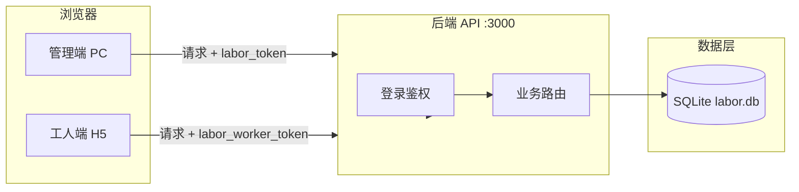
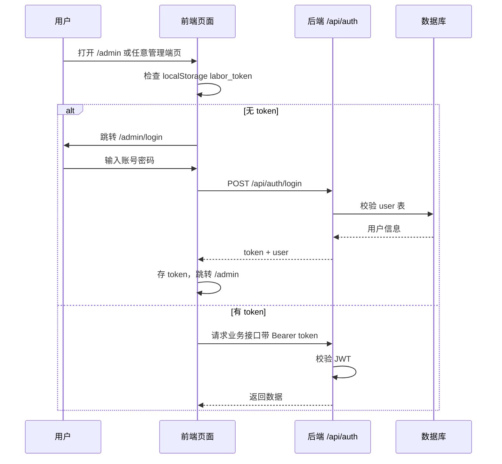
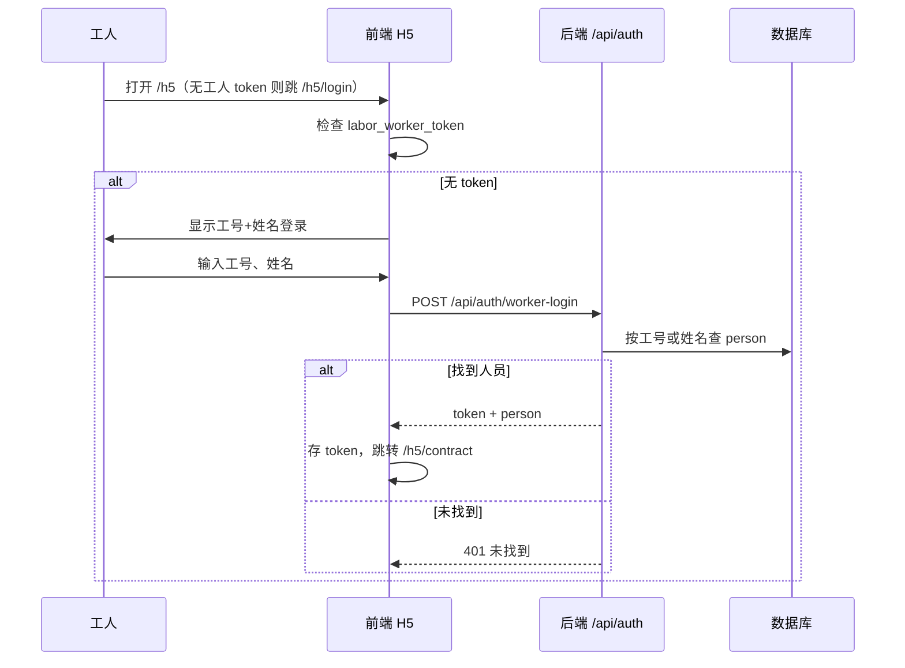
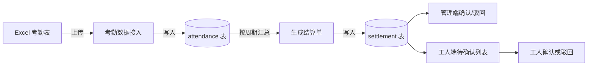
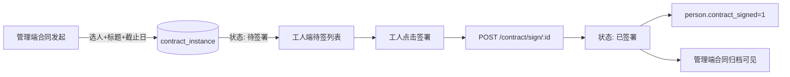

# Digital Labor · 项目说明与架构

本文档帮助你先从整体了解：做了哪些功能、目录怎么排、用了什么技术，以及关键流程怎么走。细节可再结合代码与「需求与实现对比」文档看。

---

## 一、系统架构图

整体是**前后端分离**：浏览器里跑管理端或工人端页面，所有数据通过 HTTP 请求到后端，后端再读写本地数据库。



- **管理端**：电脑访问 `/admin`，用账号密码登录，请求带 `labor_token`。
- **工人端**：手机或电脑访问 `/h5`，用工号+姓名登录，请求带 `labor_worker_token`。
- **后端**：Express 提供 REST 接口，校验 token 后查写 SQLite（文件在 `server/data/labor.db`）。

---

## 二、技术栈

| 层级 | 技术 | 说明 |
|------|------|------|
| 前端框架 | Vite + React 18 | 构建与页面组件 |
| 前端路由 | React Router 6 | /admin、/h5 及子路径 |
| 管理端请求 | 自封装 api.js | 自动带 token，401 跳登录 |
| 工人端请求 | 自封装 workerApi.js | 工人 token，401 跳工人登录 |
| 后端运行时 | Node.js | 建议 18+ |
| 后端框架 | Express 4 | REST API |
| 数据库 | SQLite (better-sqlite3) | 单文件，无需单独装数据库 |
| 认证 | JWT (jsonwebtoken) | 7 天有效，payload 含 userId 或 workerId |
| 考勤 Excel | multer + xlsx | 上传解析后入库 |
| 测试 | Node test + supertest | 后端 API 自动化测试 |

---

## 三、目录结构

只列出**项目自身**的代码与配置（不含 node_modules）。部署与开发规范见 **docs/** 目录。

```
digital-labor/
├── package.json              # 根脚本：dev、build、start、test
├── README.md                 # 项目说明与快速开始
├── 项目说明与架构.md          # 本文件：架构、流程、功能总览
├── docs/                     # 项目级文档：部署说明、开发规范、环境变量示例
├── scripts/                  # 可选构建/部署脚本
│
├── web/                      # 前端（Vite + React），前后端分离可独立构建与部署
│   ├── index.html
│   ├── vite.config.js
│   ├── package.json
│   └── src/
│       ├── main.jsx          # 入口，挂载 React + Router
│       ├── App.jsx           # 路由表：/admin/*、/h5/*
│       ├── index.css         # 全局样式
│       ├── api.js             # 管理端请求封装（带 token）
│       ├── workerApi.js      # 工人端请求封装（带工人 token）
│       ├── utils.js          # 公共方法（如组织树拍平）
│       ├── README.md         # 前端目录说明
│       ├── layouts/
│       │   ├── AdminLayout.jsx   # 管理端：侧栏 + 退出
│       │   └── H5Layout.jsx       # 工人端：底栏 + 退出
│       ├── components/
│       │   └── Placeholder.jsx   # 占位页通用组件
│       └── pages/
│           ├── admin/            # 管理端页面
│           │   ├── Login.jsx
│           │   ├── Dashboard.jsx
│           │   ├── person/       # 人员档案、认证占位、状态管理
│           │   ├── contract/     # 合同模板、发起、签约状态、归档
│           │   ├── attendance/   # 考勤导入、工时报表
│           │   ├── settlement/   # 结算单确认、薪资报表
│           │   ├── site/         # 离场登记、在岗看板
│           │   ├── data/         # 综合数据看板
│           │   └── sys/          # 用户、组织、权限占位、操作日志
│           └── h5/               # 工人端页面
│               ├── Login.jsx
│               ├── auth/         # 激活、人脸、信息绑定（占位）
│               ├── contract/     # 待签列表、签署、已签查阅
│               ├── attendance/   # 每日考勤记录
│               ├── salary/       # 待确认结算单、薪资历史
│               └── profile/      # 个人中心、消息通知
│
├── server/                   # 后端（Express + SQLite）
│   ├── server.js             # 启动脚本（监听 3000）
│   ├── app.js                # 应用入口（挂中间件与路由，供测试复用）
│   ├── package.json
│   ├── README.md             # 后端目录说明
│   ├── data/
│   │   └── labor.db          # SQLite 数据文件（运行后生成）
│   ├── db/
│   │   ├── schema.js         # 建表与默认管理员
│   │   └── index.js          # 导出 db
│   ├── middleware/
│   │   ├── auth.js           # JWT 校验
│   │   └── log.js            # 操作日志写入
│   ├── routes/
│   │   ├── auth.js           # 管理端登录、工人端登录
│   │   ├── person.js         # 人员档案、状态
│   │   ├── contract.js       # 合同模板/上传/发起/状态/归档/作废、工人待签与签署
│   │   ├── attendance.js     # 考勤导入、报表、工人我的考勤
│   │   ├── settlement.js    # 结算生成/确认、薪资、工人待确认与我的、通知写入
│   │   ├── site.js          # 离场、在岗看板
│   │   ├── data.js          # 数据看板 KPI 与趋势
│   │   ├── sys.js           # 组织、用户/批量导入、操作日志
│   │   ├── notify.js        # 工人端站内通知列表、标已读
│   │   └── worker.js        # 工人端个人档案、修改手机号/身份证
│   └── test/
│       └── api.test.js       # 后端 API 自动化测试
│
└── 功能点/
    ├── 20260302数字劳务功能报价.xlsx
    ├── excel_content_utf8.txt
    └── 需求与实现对比.md     # 报价表逐项对比、测试结果、后续设计
```

---

## 四、已实现功能点总览

按**使用角色**归纳，便于你快速知道「能做什么」。

| 角色 | 模块 | 已实现能力 |
|------|------|------------|
| 管理端 | 登录 | 账号密码登录（默认 admin / admin123），token 存本地，未登录跳登录页 |
| 管理端 | 组织 | 公司/项目部/标段/班组树形维护，增删改 |
| 管理端 | 用户 | 列表、新增、编辑、启用/禁用、改密、**批量导入**、**一键注销** |
| 管理端 | 人员档案 | 列表（按状态、组织、在岗筛选）、分页、新增、编辑、删除（不存在返回 404） |
| 管理端 | 状态管理 | 各状态人数统计、按人员 ID 批量改状态（与在岗联动） |
| 管理端 | 合同 | 模板名称新增、**文件上传**、**版本展示**；按人多选发起、截止日；签约状态列表；归档**多维度检索与作废** |
| 管理端 | 考勤 | Excel 上传解析导入（表头含人员/日期等）；工时报表筛选与 CSV 导出 |
| 管理端 | 结算 | 按周期从考勤生成结算单；列表确认/驳回；薪资报表按条件查询；生成时写入工人端通知 |
| 管理端 | 现场 | 离场登记（选在岗人员）；在岗看板按组织汇总人数 |
| 管理端 | 数据看板 | 四类 KPI 卡片、**近 7/30/90 天趋势图**（新增人员、签约数、考勤人次与工时） |
| 管理端 | 操作日志 | 按请求记录操作人、模块、结果，分页查看 |
| 工人端 | 登录 | 工号+姓名登录（需人员表已有该人），返回工人 token |
| 工人端 | 我的合同 | 待签列表、签署、已签查阅详情与 **PDF 下载**（有文件则下，无则提示）；发起时写入通知 |
| 工人端 | 我的考勤 | **按月日历视图**、点击日期查当日工时与上下班 |
| 工人端 | 我的薪资 | 待确认结算单列表与确认/驳回、薪资历史列表；确认发放时写入通知 |
| 工人端 | **个人中心** | **档案展示、手机号/身份证维护** |
| 工人端 | **消息通知** | **站内列表（合同待签/结算待确认/工资发放）、标已读** |

**占位（有菜单/路由、无完整逻辑）**：认证管理、权限分配、e 签宝/存证、H5 扫码激活/人脸/信息绑定；详见「需求与实现对比」文档。

---

## 五、关键流程图

### 5.1 管理端登录流程



### 5.2 工人端登录流程



### 5.3 考勤 → 结算主流程



- 管理端在「考勤数据接入」上传 Excel，系统解析后写入 `attendance`。
- 在「结算单确认」页选择周期，点击生成，系统按周期从考勤汇总生成 `settlement` 待确认记录。
- 管理端可在此页做确认/驳回；工人端在「我的薪资」看到待确认项并确认或驳回。

### 5.4 合同发起到签署流程



- 管理端在「合同发起」多选人员、填标题与截止日，为每人生成一条合同实例（待签署）。
- 工人在 H5「我的合同」看到待签列表，点「去签署」进入签署页，确认后调用签署接口，状态变为已签署，并回写人员签约标识；管理端「合同归档」可查已签署记录。

---

## 六、数据流与接口分层（概念）

```mermaid
flowchart TB
  subgraph Frontend
    Admin[管理端页面]
    H5Pages[工人端页面]
  end
  subgraph API_Layer
    Auth[/api/auth]
    Sys[/api/sys]
    Person[/api/person]
    Contract[/api/contract]
    Attendance[/api/attendance]
    Settlement[/api/settlement]
    Site[/api/site]
    Data[/api/data]
  end
  subgraph Storage
    Org[org]
    User[user]
    PersonTable[person]
    AttendanceTable[attendance]
    SettlementTable[settlement]
    ContractTable[contract_instance]
    OpLog[op_log]
  end
  Admin --> Auth
  Admin --> Sys
  Admin --> Person
  Admin --> Contract
  Admin --> Attendance
  Admin --> Settlement
  Admin --> Site
  Admin --> Data
  H5Pages --> Auth
  H5Pages --> Person
  H5Pages --> Contract
  H5Pages --> Attendance
  H5Pages --> Settlement
  Sys --> Org
  Sys --> User
  Sys --> OpLog
  Person --> PersonTable
  Contract --> ContractTable
  Attendance --> AttendanceTable
  Settlement --> SettlementTable
  Site --> PersonTable
  Data --> PersonTable
  Data --> ContractTable
```

- 管理端和工人端共用同一套后端与数据库；通过 **token 中的 userId / workerId** 区分身份与数据范围。
- 详细接口路径见各 `server/routes/*.js` 文件顶部注释及「需求与实现对比」中的测试用例。

---

## 七、建议阅读顺序

1. **先看本文**：弄清架构、技术栈、目录、功能总览和几条主流程。
2. **再看** `功能点/需求与实现对比.md`：了解与报价表逐项对应关系、测试结果和后续设计。
3. **动手跑**：根目录 `npm run install:all` 后 `npm run dev`，浏览器访问管理端与工人端，按上面流程走一遍。
4. **看代码**：从 `server/db/schema.js`（表结构）、`server/app.js`（路由挂载）、`web/src/App.jsx`（前端路由）按需往下看。

如你希望，我也可以把「某一块（例如仅合同、仅考勤结算）」单独拆成更细的流程图或接口列表。

---

## 八、半小时验收清单（供检验工作成果）

以下清单可在约 5～10 分钟内逐项执行，用于验证「近期改进」与「整体可运行性」。

| 序号 | 检验项 | 操作与预期 |
|:----:|--------|------------|
| 1 | 仓库忽略项 | 根目录存在 `.gitignore`，且含 `node_modules/`、`server/data/` |
| 2 | 后端测试 | 在 `server` 目录执行 `npm test`，共 12 条用例全部通过 |
| 3 | 管理端登录 | 打开 /admin，错误密码有错误提示；admin / admin123 可登录并进入工作台 |
| 4 | 工人端说明 | 打开 /h5，登录页底部有「需先在管理端人员档案中录入工人」的说明 |
| 5 | 合同发起空态 | 管理端「合同发起」在无人员时显示「暂无人员，请先在人员档案中录入」 |
| 6 | 首次使用步骤 | README 中有「首次使用与快速验证」5 步（安装、admin 登录、录入人员、H5 登录、运行测试） |
| 7 | 文档入口 | README 开头引导阅读「项目说明与架构.md」，且该文档含架构图、技术栈、目录、功能总览、流程图与本节验收清单 |

**本次约 30 分钟完成内容**：健壮性（登录响应与空态提示、后端登录参数校验）、可运行性（README 首次使用、.gitignore、2 条新增 API 测试）、文档（验收清单与说明补充）。
